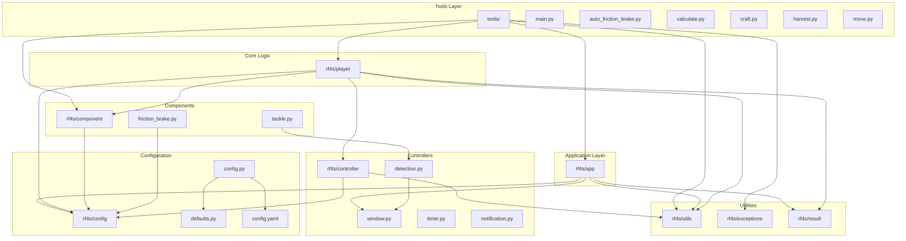

# RF4S Master Blueprint - Complete Project Architecture

## Table of Contents

### 1. Architecture Overview
- [System Architecture](#system-architecture)
- [Module Dependencies](#module-dependencies)
- [Data Flow](#data-flow)
- [Component Interaction](#component-interaction)

### 2. Core Modules
- [rf4s/app Module](#rf4sapp-module)
- [rf4s/config Module](#rf4sconfig-module)
- [rf4s/controller Module](#rf4scontroller-module)
- [rf4s/component Module](#rf4scomponent-module)
- [rf4s/player Module](#rf4splayer-module)
- [rf4s/result Module](#rf4sresult-module)
- [rf4s/utils Module](#rf4sutils-module)
- [rf4s/exceptions Module](#rf4sexceptions-module)

### 3. Tools Module
- [tools/ Directory Structure](#tools-directory-structure)
- [Individual Tool Applications](#individual-tool-applications)

### 4. Configuration System
- [Configuration Hierarchy](#configuration-hierarchy)
- [Profile Management](#profile-management)
- [Runtime Overrides](#runtime-overrides)

### 5. Detection System
- [Image Recognition Pipeline](#image-recognition-pipeline)
- [OCR Integration](#ocr-integration)
- [Visual State Management](#visual-state-management)

### 6. Automation Logic
- [Fishing Bot Core Logic](#fishing-bot-core-logic)
- [Mode-Specific Implementations](#mode-specific-implementations)
- [State Machine Architecture](#state-machine-architecture)

### 7. External Integrations
- [Notification System](#notification-system)
- [Window Management](#window-management)
- [Input Simulation](#input-simulation)

### 8. Data Management
- [Result Collection](#result-collection)
- [Session Tracking](#session-tracking)
- [Statistics Aggregation](#statistics-aggregation)

### 9. Error Handling & Recovery
- [Exception Management](#exception-management)
- [Graceful Shutdown](#graceful-shutdown)
- [Robustness Mechanisms](#robustness-mechanisms)

### 10. Testing & Validation
- [Component Testing](#component-testing)
- [Integration Testing](#integration-testing)
- [Configuration Validation](#configuration-validation)

## System Architecture

The RF4S project follows a modular, layered architecture designed for maintainability, extensibility, and separation of concerns. The system can be broken down into several key layers:

### 1. Application Layer (`rf4s/app`)
- **Base Classes**: Abstract App and concrete ToolApp classes
- **Main Application**: RF4SApp for the primary fishing bot
- **Tool Applications**: Specialized applications for specific tasks

### 2. Configuration Layer (`rf4s/config`)
- **Configuration Management**: YAML-based configuration with hierarchical overrides
- **Profile System**: User-defined fishing profiles with mode-specific settings
- **Runtime Merging**: Dynamic configuration assembly from multiple sources

### 3. Controller Layer (`rf4s/controller`)
- **Detection Controller**: Image recognition and OCR capabilities
- **Window Controller**: Game window management and interaction
- **Timer Controller**: Timing, delays, and session tracking
- **Notification Controller**: External notification services

### 4. Component Layer (`rf4s/component`)
- **Game Components**: Friction brake automation and tackle management
- **Specialized Logic**: Encapsulated game-specific behaviors

### 5. Core Logic Layer (`rf4s/player`)
- **Player Class**: Central orchestrator for fishing automation
- **Mode Implementations**: Specific logic for different fishing modes
- **State Management**: Fish fighting, resource management, keepnet handling

### 6. Utilities Layer (`rf4s/utils`, `rf4s/exceptions`, `rf4s/result`)
- **Helper Functions**: Common utilities and logging
- **Exception Handling**: Custom exceptions for specific error conditions
- **Result Management**: Data collection and presentation

### 7. Tools Layer (`tools/`)
- **Entry Points**: Individual applications for specific automation tasks
- **CLI Interface**: Command-line interface and user interaction

## Module Dependencies

## Data Flow

The data flow in RF4S follows a clear pattern from configuration loading through execution to result presentation:

1. **Configuration Assembly**
   - Load programmatic defaults
   - Merge config.yaml
   - Apply command-line arguments
   - Select and merge profile settings

2. **Application Initialization**
   - Initialize controllers and components
   - Validate configuration and environment
   - Activate game window

3. **Core Execution Loop**
   - Player orchestrates fishing routine
   - Controllers handle game interaction
   - Components manage specific behaviors
   - Results are collected continuously

4. **Result Presentation**
   - Aggregate session data
   - Format results for display
   - Send notifications if configured
   - Clean shutdown

## Implementation Phases

### Phase 1: Foundation Setup
1. **Environment Setup**
   - Python 3.12+ installation
   - Required dependencies (OpenCV, Tesseract, etc.)
   - Virtual environment configuration

2. **Core Structure**
   - Directory structure creation
   - Base classes implementation (App, ToolApp)
   - Configuration system setup

### Phase 2: Configuration System
1. **YAML Configuration**
   - config.yaml structure definition
   - Default values in defaults.py
   - Configuration loading and merging logic

2. **Profile System**
   - Profile definition structure
   - Runtime profile selection
   - Configuration validation

### Phase 3: Controller Implementation
1. **Window Management**
   - Game window detection and activation
   - Resolution validation
   - Window state management

2. **Detection System**
   - Image template loading
   - OpenCV integration
   - OCR setup with Tesseract

3. **Timer and Notification**
   - Timing utilities implementation
   - External notification services
   - Session tracking

### Phase 4: Core Logic Development
1. **Player Class Foundation**
   - Basic fishing loop structure
   - State management
   - Error handling framework

2. **Mode-Specific Logic**
   - Spin fishing implementation
   - Bottom fishing implementation
   - Other mode implementations

### Phase 5: Component Integration
1. **Friction Brake**
   - Automatic brake adjustment logic
   - Integration with Player class

2. **Tackle Management**
   - Tackle statistics calculation
   - OCR-based data extraction

### Phase 6: Tools Development
1. **Individual Tools**
   - Craft automation
   - Harvest automation
   - Movement automation
   - Calculate tool

2. **CLI Interface**
   - Main menu implementation
   - Argument parsing
   - Tool dispatching

### Phase 7: Testing and Validation
1. **Unit Testing**
   - Component-level tests
   - Configuration validation tests
   - Mock game environment setup

2. **Integration Testing**
   - End-to-end workflow testing
   - Error scenario testing
   - Performance validation

### Phase 8: Documentation and Deployment
1. **Documentation**
   - User guides
   - Developer documentation
   - Configuration references

2. **Deployment**
   - Executable compilation
   - Distribution packaging
   - Installation guides

## Missing Components Analysis

Based on the provided documentation, the following components appear to be missing or incomplete:

### 1. Missing Blueprint Files
- Individual controller blueprints (detection.py, window.py, timer.py, notification.py)
- Component-specific blueprints (friction_brake.py, tackle.py)
- Utility module detailed blueprints
- Tool-specific implementation blueprints

### 2. Missing Diagram Files
- Sequence diagrams for each fishing mode
- State machine diagrams for Player class
- Component interaction diagrams
- Error handling flow diagrams

### 3. Missing Implementation Details
- Image template management system
- OCR configuration and calibration
- Input simulation error handling
- Session persistence mechanisms

### 4. Missing Testing Infrastructure
- Unit test framework setup
- Mock game environment
- Configuration validation tests
- Performance benchmarking

This master blueprint serves as the foundation for generating all individual component blueprints and diagrams. Each section will be expanded into detailed, standalone documentation files.